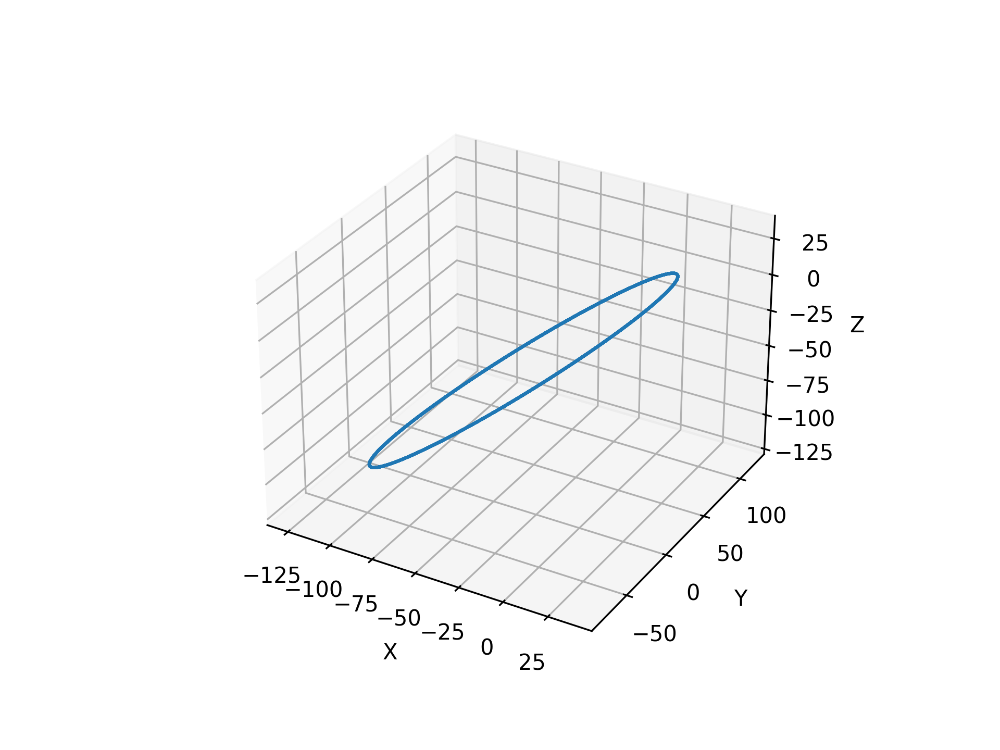
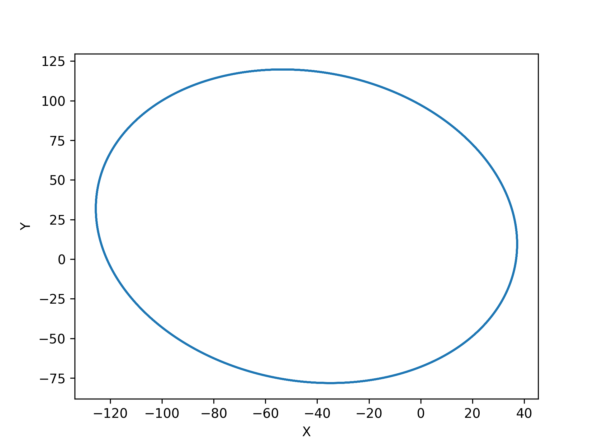
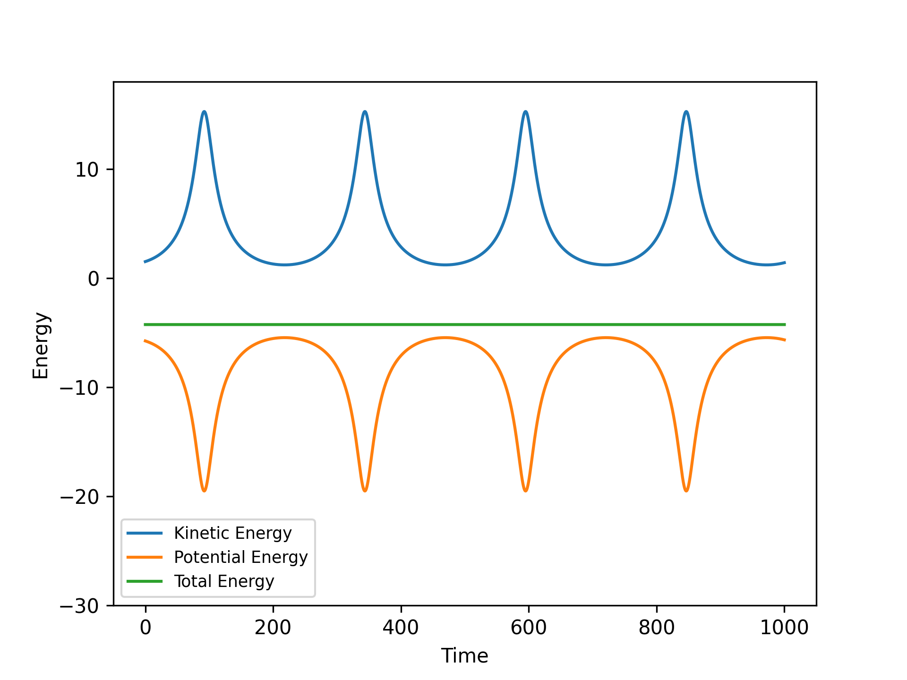
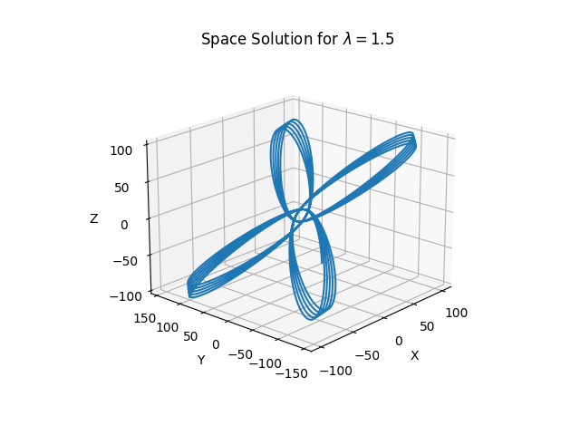
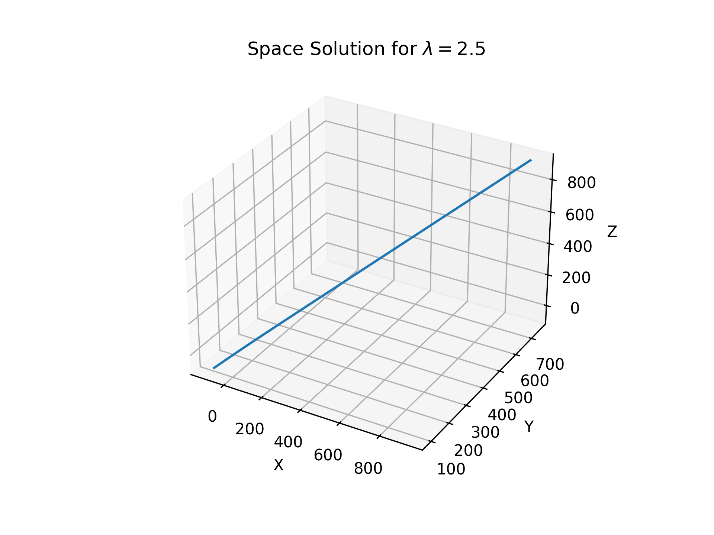
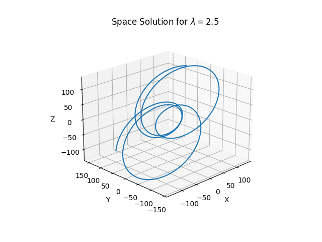

# Molecular Dynamics

The molecular dynamics is a simulation technique largely used in physics, astrophysics, chemistry and materials science. It consists in integrate the equation of motion of N classical particles system using the Verlet algorithm. This repository will be organized as follow: First we will present what is the Verlet algorithm, then we will apply it for two problems: A particle under a central force and N-body gravitational problem.

## The Verlet Algorithm

In another repository we discussed more about differential equations an presented some techniques to solve them, as you can see in this [README](https://github.com/jescott07/solving-differential-equations/blob/main/README.md). If we where in a classical world, i.e. we are studing an not so small systens that we would need to use quantum mechanics and also not so massive and fast enoth that we needed to use general relativity. Thus the equation of motion is given by the second Newton's Law, wich is given by the equation:

$F = m a$.

Where $F$ is the force being apply under the particle with mass $m$ and $a=\frac{dv}{dt} = \frac{d^2x}{dt^2}$ is the aceleration of that particle. Thus, the equation of motion ia a second order differential equation:

$F = m \ddot x(t)$.

Where $\ddot x(t)$ represents the second order derivative of x in relation to time (t).

The Verlet algorithm consist at first discretize the time $t$, such:

$t_i = t_0 + i\Delta t \qquad i = 1,...,N$.

Where $t_0$ is the inicial time, $\Delta t$ the step size in time and N is the number of iterations. Thus  the numerical solution for each $t_i$ is a approximation of the real solution $x_i \approx x(t_i)$, then our solution space will be discretized as well as the acceleration, so:

$a_i = \frac{\Delta^2 x}{\Delta t^2} = \frac{\frac{\Delta x_{i+1}}{\Delta t} - \frac{\Delta x_i}{\Delta t}}{\Delta t}$.

Where:

$\frac{\Delta x_{i+1}}{\Delta t} = \frac{x_{i+1} - x_i}{\Delta t}$,

and

$\frac{\Delta x_{i}}{\Delta t} = \frac{x_{i} - x_{i-1}}{\Delta t}$.

Then:

$a_i = \frac{\frac{x_{i+1} - x_i}{\Delta t} - \frac{x_{i} - x_{i-1}}{\Delta t}}{\Delta t} = \frac{x_{i+1} - 2x_i + x_{i-1}}{\Delta t^2}$.

So, knowing $x_0, x_1$ and $a_i \forall i$ we can advance the solution as:

$x_{i+1} = a_i \Delta t^2 + 2 x_i - x_{i-1}$

Remembering that:

$a_i = \frac{F_i}{m}$

If the force is proporcional to the velocity we also need to compute its solution, remembering that:

$v = \frac{\Delta x}{\Delta t}$

Then the solution $v_i \approx v(t_i)$ can be computed as:

$v_i = \frac{x_{i+1} - x_{i-1}}{2\Delta t}$

So, if we know the mass and the force acting on the particle then we will also know the acceleration of the particle and then, from the inicial conditions, we can determine the position and the velocity of the particle in every discretized time. With this, we can compute the mechanical energy of the system, wich is given by the equation:

$E_{mec} = K + U$

Where, K is the kinetic energy and U is the potencial energy. Wich are given by the equations:

$K = \frac{1}{2} m v^2$,

and

$U = -\int_{x_i}^{x_f} F_x dx$,

wich is the potencial for a conservative force, in the dirrection of $x$, betwen $x_i$ and $x_f$.

We can implement this method through the following pseudo-algorithm:

**Algorithm** *Verlet*

**Input** $f(x, \dot x, t)$: Second order differential equation to be integrated (function), $x(0)$, $\dot x(0) = v(0), t_0$: initial conditions (float), $dt$: Integration step (float), $N$: Number of integration steps (positive integer).

**Output** $x(N)$, $t(N)$: Vectors with size N containing the solutions of the system.

**Compute x(i+1), t(i+1) for each x(i) and t(i) from $f(x, \dot x, t)$ and $dt$ as discussed above.**

1. Define i = 1.
2. Define $x(0) = x_i$, $v(0) = v_i$ and $t(0) = t_i$ (the initial condition inputs)
3. Define $x(1) = x(0) + v(0) dt + \frac{1}{2}f(x(0),v(0),t_0)$ dt^2
4. Define dt2 = $dt^2$
4. **do**

      x(i+1) = 2x(i) - x(i-1) + f(x(i), v(i), t(i))*dt2
      
      v(i+1) = (x(i+1) - x(i-1)) / 2dt
      
      t(i+1) = t(i) + h
      
      i = i + 1
      
    **while** i $\neq$ N + 1
    
 4. Return x(N), v(N) and t(N).

## A particle under a central force

A force directed to the center wich decay with the distance (r) to the center, i.e. $\propto \frac{1}{r^\lambda}$ is:

  $\vec F = - k' \frac{\hat r}{r^\lambda} = - k' \frac{\vec r}{r^{\lambda + 1}}$

Where, $\vec r$ is a three dimensional vector, $k'$ is the proportionality factor and $\lambda$ is the decay factor. Thus, from the Newton's second law the aceleration will be:

$\vec a = \vec{\ddot{r}} = - \frac{k'}{m}\frac{\vec r}{r^{\lambda + 1}} \equiv -k \frac{\vec r}{r^{\lambda + 1}}$

From this force, the energy is:

$K_i = \frac{1}{2}v_i^2$

and for $\lambda < 1$:

$U_i = \frac{-k}{\lambda - 1} r_i^{\lambda - 1}$

With that $\vec{a}$ and using the Verlet algorithm presented above, we computed the position $x_i$, the velocity $v_i$ and the energy of the system for every discretized time $t_i$, setting: $\Delta t = 0,01$, $k = 1000$, $\vec{r_0} = -100 \hat i + 100 \hat j - 100 \hat k$, $\vec{v_0} = 1\hat i + 1 \hat j + 1 \hat k$ and varying $\lambda$.

First, lets investigate the Newtonian gravitation where $\lambda = 2$. The space solution is show in the figure below:

And the solution in the $x \times y$ plane is:

From these results we see that for the Newtonian gravitacion we have a closed elliptical orbit as we spected. And for the energy we have:

Thus, the kinect and the potential energy oscillates, however, the mechanical energy is conserved.

For $\lambda = 1.5$ we have the space solution:

and for $\lambda = 2.5$:

Notice that for $\lambda = 2.5$ the particle acts like a free particle, i.e. it is ejected from the orbit. This because as $F \propto \lambda^{-1}$ the force under the particle is weeker if we compere to others values of $\lambda$. So, to see the orbit we need a greater value of $k$, thus lets define $k=10000$ and run the program again. So, we have the solution:

